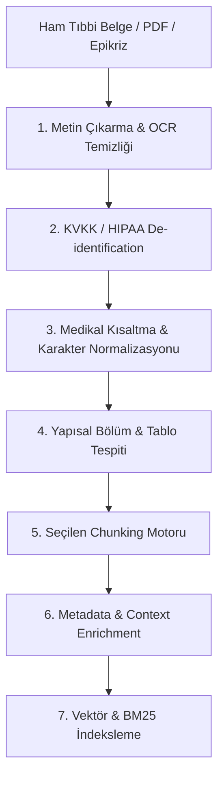

# 🧪 TrustLab — Metin Parçalama (Chunking) & Veri Ingestion Deney Yol Haritası

**Oluşturulma Tarihi:** 18 Ağustos 2026  
**Kapsam:** RAG Mimarisi, Chunking Stratejileri, Tıbbi & Regüle Veri Ingestion Pipeline'ı  
**Hedef:** Tıbbi malpraktis risklerini sıfıra indiren, bağlam bütünlüğünü koruyan ve arama keskinliğini (Retrieval Precision/Recall) maksimize eden en ideal veri hazırlama ve parçalama mimarisini deneysel olarak tespit etmek.

---

## 📌 Giriş ve Problem Tanımı

RAG (Retrieval-Augmented Generation) sistemlerinde üretim kalitesinin **%80'i veri hazırlama (ingestion) ve metin parçalama (chunking)** aşamasında belirlenir. Sağlık sektöründe (epikrizler, klinik rehberler, ilaç prospektüsleri, laboratuvar sonuçları) kör metin parçalama yöntemleri:
1. İlaç dozu ile alerji/kontrendikasyon uyarılarını birbirinden koparabilir,
2. Lab değerlerini (sayısal veri + referans aralığı) bağlamsız bırakabilir,
3. Tıbbi kısaltmalardaki noktaları (`i.v.`, `mg.`, `Dr.`) cümle sonu sanıp anlamı parçalayabilir.

Bu doküman, TrustLab bünyesinde gerçekleştirilecek tüm **Chunking ve Veri Ingestion deneylerini** sistematik bir matris halinde sunar.

---

## 🔬 Kategori 1: Temel ve İleri Düzey Chunking Stratejileri

| Deney Kodu | Strateji Adı | Çalışma Mantığı | Hipotez & Beklenti | Öncelik |
| :--- | :--- | :--- | :--- | :--- |
| **EXP-CHK-01** | **Fixed-Size Token / Character Chunking** | Sabit token (örn. 256 token) veya karakter (1024 char) sınırıyla kör bölme. | Baseline (kıyaslama referansı) olarak kullanılacak. Cümle ve anlam bölünmelerinde yüksek bilgi kaybı bekleniyor. | P1 |
| **EXP-CHK-02** | **Recursive Character Splitting** | Çift satır sonu (`\n\n`), tek satır sonu (`\n`), cümle (`. `) ve kelime (` `) hiyerarşisiyle bölme. | Paragraf ve bölüm bütünlüğünü koruyarak kör bölmeye kıyasla retrieval kalitesini belirgin artırması beklenir. | P1 |
| **EXP-CHK-03** | **Semantic Boundary Splitting** *(Mevcut)* | Doğal cümle sınırları + Lookback heuristiği + Kayan pencere (Sliding overlap). | Kelime ortası bölünmeleri engeller, offset koordinatlarıyla kesin atıf (citation) sağlar. | Tamamlandı (Baz Alındı) |
| **EXP-CHK-04** | **Semantic Similarity / Distance Chunking** | Cümle embedding'leri arasındaki kosinüs mesafesi bir eşiği (threshold) aştığında bölme. | Genel metinlerde konu değişimlerini yakalar; ancak tıp metinlerinde dozaj-uyarı kopmasına yol açabileceği için test edilmeli. | P2 |
| **EXP-CHK-05** | **Parent-Child (Hiyerarşik) Chunking** | İndeksleme için küçük parçalar (128 token), LLM bağlamı için ebeveyn parçalar (512-1024 token). | Küçük parçalar arama keskinliğini artırırken, LLM'e giden geniş bağlam sayesinde halüsinasyon ve bağlam kaybı engellenecek. | P1 |
| **EXP-CHK-06** | **Contextual Chunking (Context-Enriched)** | Her chunk'ın başına belgenin veya bölümün ana bağlamını/özetini ekleyerek embedding alma. | Zamir karmaşasını (anaphora resolution) çözer; bağımsız parçalarda bile global bağlam korunur. | P2 |
| **EXP-CHK-07** | **Late Chunking** | Tüm belgeyi önce uzun bağlamlı Transformer'dan geçirip token embedding'lerini alıp ardından chunk havuzlama (mean pooling) yapma. | Chunk sınırlarının ötesindeki bağlam token vektörlerine sindiği için sınır kayıpları teorik olarak sıfırlanır. | P3 |

---

## 🏥 Kategori 2: Sağlık Sektörüne & Tıbbi Veriye Özel Deneyler

| Deney Kodu | Deney Adı | Odak & Metodoloji | Tıbbi Güvenlik Kriteri |
| :--- | :--- | :--- | :--- |
| **EXP-MED-01** | **Section-Aware Clinical Chunking (Klinik Bölümleme)** | Epikriz ve hasta dosyalarını yapısal başlıklara göre (`Şikayet`, `Öykü`, `Fizik Muayene`, `Tanı`, `Tedavi/Reçete`, `Epikriz Notu`) ayırma. | Şikayet ile kesin tanının birbirine karışmasını önleme. |
| **EXP-MED-02** | **Atomic Medical Units (Bölünemez Dozaj & Uyarı Blokları)** | Etken madde, dozaj, kullanım sıklığı, kontrendikasyon ve alerji bilgilerinin aynı atomik chunk içinde kilitlenmesi kuralı. | **Sıfır Malpraktis:** İlaç dozu uyarısından asla ayrılamaz. |
| **EXP-MED-03** | **Tıbbi Kısaltma ve Noktalama Sanitizasyonu** | Tıbbi metinlerdeki `i.v.`, `p.o.`, `s.c.`, `mg.`, `Tab.`, `U/L` ve `Dr.` gibi noktalı ifadelerin cümle sonu sanılmaması için Regex/NLP kuralları. | Sahte cümle bölünmelerini ve anlamsız mikro-parçaları engelleme. |
| **EXP-MED-04** | **Laboratuvar & Sayısal Tablo Koruma (Lab Value Integrity)** | Kan tahlilleri, biyokimya sonuçları ve referans aralıklarını Markdown/HTML tablo veya JSON-LD yapısında tutarak chunking. | Sayısal değerin test adı ve biriminden (`14.2 g/dL`) kopmasını engelleme. |
| **EXP-MED-05** | **Zaman Çizelgesi & Hasta Geçmişi (Temporal Chunking)** | Kronik hastalık geçmişi, ameliyat tarihleri ve ardışık vizitlerin kronolojik metadata ile etiketlenerek parçalanması. | Eski bir teşhisin güncel akut durumla karıştırılmasını önleme. |

---

## ⚙️ Kategori 3: Ingestion & Ön İşleme (Pre-processing) Pipeline Deneyleri



1. **EXP-ING-01: PHI/PII Anonimizasyon (De-identification) Pipeline'ı:**
   - Hasta adı, TC kimlik, telefon vb. hassas verilerin chunking öncesi maskelenmesi (`[HASTA_ADI]`, `[TARIH]`).
   - Anonimizasyonun semantik anlama ve embedding kalitesine etkisinin ölçülmesi.

2. **EXP-ING-02: Kayan Pencere Örtüşme (Overlap) Oranları:**
   - Örtüşme oranlarının kıyaslanması: `%0`, `%10 (25 token)`, `%20 (50 token)`, `%30 (75 token)`.
   - İndeks boyutu (token maliyeti) ile sınır bilgilerini yakalama (boundary recall) arasındaki dengenin tespiti.

3. **EXP-ING-03: Metadata Enjeksiyonu ve Filtreleme:**
   - Her chunk'a eklenecek metadata: `{ "document_type": "epicrisis", "icd10_codes": ["E11.9"], "department": "Cardiology", "patient_id": "...", "timestamp": "..." }`.
   - Hibrit filtreleme (Metadata Pre-filtering + Vector Search) hız ve doğruluk testi.

---

## 📊 Ölçüm Kriterleri ve Değerlendirme Matrisi (Evaluation Metrics)

Yapılacak her deney aşağıdaki 3 eksende puanlanacaktır:

### 1. Retrieval Kalitesi (Arama Keskinliği)
* **Hit Rate @ K (K=3, 5):** Aranan bilginin ilk K parça içinde gelme oranı.
* **MRR (Mean Reciprocal Rank):** Doğru bilginin kaçıncı sırada geldiğinin skoru.
* **Context Recall & Precision:** Sorgu için gerekli tüm bilgilerin getirilip getirilmediği ve gereksiz gürültü oranı.

### 2. Üretim & Klinik Güvenlik (Ragas / TruLens / Custom Guardrails)
* **Faithfulness (Sadakat):** Model cevabının sadece getirilen chunk'lara dayanma oranı (Halüsinasyon kontrolü).
* **Malpractice & Safety Score:** Tıbbi uyarıların veya dozların eksik kalma/çarpıtılma vakası sayısı (Hedef: **0 hata**).
* **Citation Accuracy:** Cevapta gösterilen sarı vurgunun (`startOffset`, `endOffset`) orijinal metindeki doğruluğu.

### 3. Sistem & Donanım Performansı
* **Ingestion Throughput:** Saniyede işlenen doküman/karakter sayısı.
* **Memory & Index Footprint:** Bellek tüketimi ve vektör veritabanı boyutu.
* **Token Consumption:** LLM prompt'una giden gereksiz token maliyeti.

---

## 🗓️ Önerilen Uygulama Fazları

```
┌─────────────────────────────────────────────────────────────────────────┐
│ FAZ 1: Temel Karşılaştırma & Hiyerarşik Yapı                            │
│ • EXP-CHK-01 (Fixed), EXP-CHK-02 (Recursive), EXP-CHK-05 (Parent-Child) │
├─────────────────────────────────────────────────────────────────────────┤
│ FAZ 2: Medikal & Klinik Alan İyileştirmeleri                            │
│ • EXP-MED-01 (Section-Aware), EXP-MED-02 (Atomic Unit), EXP-MED-03 (Abbr)│
├─────────────────────────────────────────────────────────────────────────┤
│ FAZ 3: İleri Pipeline & Context Enjeksiyonu                             │
│ • EXP-CHK-06 (Contextual Retrieval), EXP-CHK-07 (Late Chunking)         │
│ • EXP-ING-01 (Anonimizasyon), EXP-ING-03 (Metadata Filtreleme)          │
└─────────────────────────────────────────────────────────────────────────┘
```

---
*Bu doküman, TrustLab RAG araştırma ve geliştirme sürecinde yapılacak deneylerin referans planıdır.*
