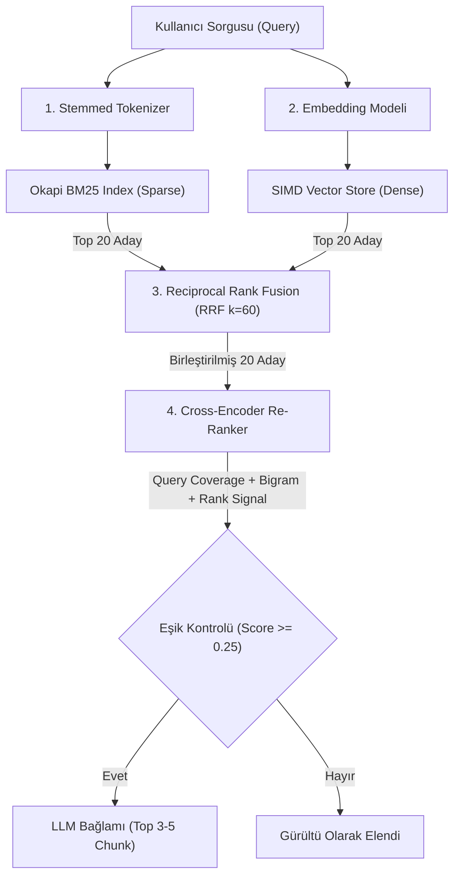

# 🛡️ TrustLab Mühendislik Rehberi — Gün 2: Retrieval, Vektörler ve Hibrit Arama

**Tarih:** 19 Ağustos 2026  
**Odak:** Bilgi Getirme (Retrieval) Mimarisi, Seyrek/Yoğun İndeksleme, Hibrit Füzyon (RRF) ve Yeniden Sıralama (Re-Ranking)

---

## 📖 1. Kapsamlı Sektörel Terimler Sözlüğü (Glossary of Terms)

Aşağıdaki tablo, kurumsal seviyedeki RAG sistemlerinde kullanılan temel İngilizce terimleri, Türkçe karşılıklarını ve sistemdeki rollerini özetler:

| İngilizce Terim (English Term) | Türkçe Karşılığı | Mühendislik Tanımı & Sistemdeki Rolü |
| :--- | :--- | :--- |
| **Information Retrieval (IR)** | Bilgi Getirme / Erişimi | Kullanıcının sorgusuna en uygun metin parçalarını büyük bir veri tabanından bulup getiren disiplin. |
| **Lexical Search** | Leksikal (Kelime Bazlı) Arama | Anlama bakmaksızın, harfiyen eşleşen kelimelerin varlığı ve sıklığı üzerinden yapılan arama türü. |
| **Sparse Indexing** | Seyrek İndeksleme | Sözlükteki kelime havuzunu sütun kabul eden, dokümanda yalnızca geçen kelimelerin pozitif değer aldığı, geri kalanın `0` olduğu matris yapısı. |
| **Tokenization & Stemming** | Jetonlaştırma ve Kök Bulma | Metni kelime/kelime parçalarına ayırma (Tokenization) ve dilbilgisel ekleri temizleyerek kelime kökünü elde etme (Stemming) adımı. |
| **Term Frequency (TF)** | Kelime Sıklığı | Aranan bir terimin belirli bir metin parçası (chunk) içinde kaç kez geçtiğinin ölçümü. |
| **Inverse Document Frequency (IDF)** | Ters Belge Sıklığı | Bir kelimenin tüm arşiv genelindeki nadirliğini ölçen istatistiksel ceza/ödül çarpanı (*"ve"* değersizdir, *"Amoksisilin"* çok değerlidir). |
| **Okapi BM25** | Okapi BM25 Skoru | TF-IDF'in kelime doygunluğu ($k_1$) ve doküman uzunluğu cezası ($b$) ile modernize edilmiş endüstri standardı sıralama algoritması. |
| **Dense Vector / Embedding** | Yoğun Vektör / Gömme | Metinlerin anlamsal içeriğini 768 veya 1536 boyutlu ondalıklı sayılar dizisine dönüştüren yapay zeka temsili. |
| **Vector Space** | Vektör Uzayı | Anlamca birbirine benzeyen kelime ve cümlelerin birbirine geometrik olarak yakın konumlandığı çok boyutlu koordinat sistemi. |
| **Cosine Similarity** | Kosinüs Benzerliği | İki çok boyutlu vektör arasındaki açının kosinüsü (Açı $0^\circ \rightarrow 1.0$ birebir aynı anlam, $90^\circ \rightarrow 0.0$ alakasız). |
| **SIMD (Single Instruction, Multiple Data)** | Tek Komut, Çoklu Veri | CPU'nun tek bir donanım döngüsünde birden fazla ondalıklı sayıyı (AVX2/AVX-512) paralel olarak işlemesini sağlayan donanım mimarisi. |
| **Hybrid Search** | Hibrit Arama | Kelime kesinliği sağlayan Sparse (BM25) ile anlamsal benzerlik sağlayan Dense (Vektör) aramasını birlikte çalıştırma yaklaşımı. |
| **Score Incommensurability** | Skor Kıyaslanamazlığı | BM25'in ürettiği sınırsız pozitif puanlar ile vektör kosinüs benzerliğinin ($0.0 - 1.0$) doğrudan toplanıp kıyaslanamaması problemi. |
| **Reciprocal Rank Fusion (RRF)** | Karşılıklı Sıra Füzyonu | Farklı arama algoritmalarından gelen sonuçları ham puanlarına bakmadan, yalnızca **sıralama derecelerine (Rank)** göre adilce birleştiren füzyon formülü. |
| **Bi-Encoder** | İkili Kodlayıcı | Soruyu ve metni birbirinden tamamen bağımsız olarak vektörleştiren, hızlı ama yüzeysel arama modeli. |
| **Cross-Encoder** | Çapraz Kodlayıcı | Soruyu ve metin parçasını yan yana koyup (`[Soru] + [Metin]`) aralarındaki derin anlamsal ve gramatikal bağı inceleyen yüksek doğruluklu model. |
| **Re-Ranking** | Yeniden Sıralama | İlk aşamada getirilen aday parçaların (örn. 20 adet), LLM'e gitmeden önce daha hassas kriterlerle filtrelenip ilk 3-5 sıraya dizilmesi. |
| **Noise Filtering / Thresholding** | Gürültü Eleme & Eşik Değeri | Re-ranking skoru belirlenen kalite eşiğinin (örn. 0.25) altında kalan parçaların LLM'e gitmesini engelleyerek halüsinasyonu önleme yöntemi. |

---

## 🔬 2. Dört Temel Mühendislik Bileşeninin Derin Analizi

---

### Adım 1: Okapi BM25 & Seyrek İndeksleme (Sparse Indexing)
* **İlgili Sınıf:** [`Bm25SparseIndex.cs`](../../src/TrustLab.Rag/Indexing/Bm25SparseIndex.cs)

#### Çalışma Prensibi
Vektör modelleri teknik ürün kodları (`RTX-4090`), tıbbi kısaltmalar (`i.v.`, `p.o.`), dozajlar (`1000mg`) ve sayısal verilerde sıklıkla bulanıklaşır (anlamsal genelleme yapar). Okapi BM25 bu açığı kapatır.

#### Matematiksel Formül
$$Score(D, Q) = \sum_{i=1}^{N} IDF(q_i) \cdot \frac{f(q_i, D) \cdot (k_1 + 1)}{f(q_i, D) + k_1 \cdot \left(1 - b + b \cdot \frac{|D|}{\text{avgdl}}\right)}$$

* **$f(q_i, D)$:** $q_i$ teriminin dokümandaki frekansı (TF).
* **$k_1 = 1.5$:** Term Saturation (Kelime Doygunluğu). Kelime tekrar ettikçe artan puanın logaritmik olarak doyuma ulaşmasını sağlar.
* **$b = 0.75$:** Document Length Penalty (Doküman Uzunluğu Cezası). Uzun metinlerin şans eseri kelime barındırma avantajını normalize eder.

---

### Adım 2: SIMD Destekli Yoğun Vektör Arama (SIMD Dense Vector Store)
* **İlgili Sınıf:** [`DenseVectorStore.cs`](../../src/TrustLab.Rag/Indexing/DenseVectorStore.cs)

#### Çalışma Prensibi
Kelimeler farklı olsa bile eş anlamlı veya ilişkili fikirleri yakalar (Örn: *"mide yanması"* $\leftrightarrow$ *"gastroözofageal reflü"*).

#### SIMD ve Donanım Hızlandırması
1536 boyutlu iki vektörün kosinüs benzerliği formülü:
$$\text{Cosine Similarity}(\mathbf{A}, \mathbf{B}) = \frac{\mathbf{A} \cdot \mathbf{B}}{\|\mathbf{A}\|_2 \|\mathbf{B}\|_2} = \frac{\sum_{i=1}^{n} A_i B_i}{\sqrt{\sum_{i=1}^{n} A_i^2} \sqrt{\sum_{i=1}^{n} B_i^2}}$$

* Standart bir CPU döngüsü bu $1536$ çarpımı tek tek yaparken, `System.Numerics.Tensors.TensorPrimitives.CosineSimilarity` işlemcinin AVX2/AVX-512 vektör register'larını kullanarak 8 ila 16 float sayıyı tek saat darbesinde işler.

---

### Adım 3: Hibrit Arama & Füzyon (Reciprocal Rank Fusion - RRF)
* **İlgili Sınıf:** [`ReciprocalRankFusion.cs`](../../src/TrustLab.Rag/Fusion/ReciprocalRankFusion.cs)

#### Çalışma Prensibi
BM25'in çıkardığı skor aralığı ($[0, \infty)$) ile vektör benzerlik skoru ($[-1, 1]$) doğrudan toplanamaz. RRF, puan değerlerini yok sayar ve dokümanın **kaçıncı sırada** olduğuna odaklanır.

#### RRF Formülü
$$RRF\_Score(d \in D) = \sum_{m \in M} \frac{w_m}{k + r_m(d)}$$

* $M$: Arama yöntemleri kümesi ($\{\text{BM25}, \text{Dense Vector}\}$).
* $w_m$: İlgili arama yönteminin ağırlık katsayısı (varsayılan: $1.0$).
* $k = 60$: Endüstri standardı yumuşatma sabiti. İlk sıradaki dokümanın ezici bir farkla tüm alt sıraları domine etmesini engeller.

---

### Adım 4: Cross-Encoder & Yeniden Sıralama (Re-Ranking)
* **İlgili Sınıf:** [`CrossEncoderReranker.cs`](../../src/TrustLab.Rag/Reranking/CrossEncoderReranker.cs)

#### Çalışma Prensibi
Hibrit füzyondan çıkan 20 aday parça, LLM prompt'una doğrudan verilirse model alakasız detaylardan etkilenip halüsinasyon görebilir (*Lost in the Middle* fenomeni).

Re-Ranker motorumuz her adayı şu üçlü sinyalle puanlar:
1. **Query Term Coverage (%55):** Sorudaki stop-word olmayan köklerin dokümanda bulunma oranı.
2. **Sequential Bigram Affinity (%25):** İkili kelime gruplarının ardışık geçiş uyumu (Kelimeler cümle içinde yan yana mı?).
3. **Prior Rank Signal (%20):** İlk aşama RRF sıralamasından gelen göreceli öncelik.

$$\text{Final Score} = (\text{Coverage} \times 0.55) + (\text{Bigram Affinity} \times 0.25) + (\text{Rank Signal} \times 0.20)$$

* **Threshold Güvenliği:** $\text{Final Score} < 0.25$ olan tüm adaylar doğrudan reddedilir.

---

## 🛠️ 3. Kod Tabanındaki Doğrudan Bağlantılar

| Bileşen Adı | Kaynak Dosya Linki | Temel Fonksiyon / Satır |
| :--- | :--- | :--- |
| **BM25 Sparse Index** | [`Bm25SparseIndex.cs`](../../src/TrustLab.Rag/Indexing/Bm25SparseIndex.cs) | `IndexChunksAsync`, `SearchAsync` |
| **SIMD Dense Vector Store** | [`DenseVectorStore.cs`](../../src/TrustLab.Rag/Indexing/DenseVectorStore.cs) | `TensorPrimitives.CosineSimilarity` |
| **Reciprocal Rank Fusion** | [`ReciprocalRankFusion.cs`](../../src/TrustLab.Rag/Fusion/ReciprocalRankFusion.cs) | `Fuse` ($k=60$) |
| **Cross-Encoder Re-Ranker** | [`CrossEncoderReranker.cs`](../../src/TrustLab.Rag/Reranking/CrossEncoderReranker.cs) | `RerankAsync` (Coverage + Bigram) |
| **Hibrit Pipeline Orkestratörü** | [`HybridRetriever.cs`](../../src/TrustLab.Rag/Pipeline/HybridRetriever.cs) | `RetrieveAsync` |

---
*Bu doküman, TrustLab mimarisinin 2. Gün Ar-Ge ve mühendislik standardını belgelemek amacıyla hazırlanmıştır.*
