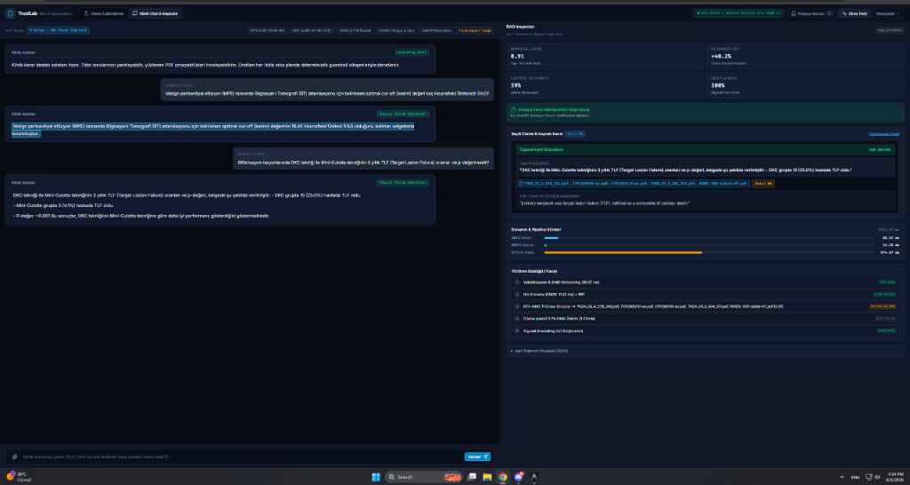

# 🚨 Production RAG Kritik Hataları ve Vaka Analizleri

> **Vaka #01:** Tablo Verilerinde Sütun ve Sayısal Ters Eşleme (*Entity-Attribute / Column Inversion Hallucination*)  
> **Tarih:** 2026-09-03  
> **Konu:** Tıbbi / Finansal RAG Sistemlerinde En Tehlikeli Gizli Halüsinasyon Türü  
> **Referans Belge:** `TKDA_53_4_238_246.pdf` (Table 4 - Complex Bifurcation Lesions)

---

## 📌 1. Vaka Özeti (Ne Yaşandı?)

Kullanıcı, TrustLab klinik RAG sistemine şu net soruyu sordu:
> **Soru:** *"Bifürkasyon lezyonlarında DKC tekniği ile Mini-Culotte tekniğinin 3 yıllık TLF (Target Lesion Failure) oranları ve p-değeri nedir?"*

### 📊 Gerçek Makale Tablo Verisi (Ground Truth - Table 4):
| Grup | 3 Yıllık TLF (Hasta Sayısı / Oran) | İstatistiksel Anlamlılık |
| :--- | :--- | :--- |
| **Mini-Culotte (n = 60)** | **15 (%25.0)** *(Daha Kötü / Yüksek Başarısızlık)* | --- |
| **DK Culotte (n = 74)** | **3 (%4.1)** *(Daha Başarılı / Düşük Başarısızlık)* | **P < 0.001** |

---

### ❌ LLM'in Ürettiği Hatalı Yanıt (Sayısal Ters Eşleme):
> *"DKC tekniği ile Mini-Culotte tekniğinin 3 yıllık TLF oranları ve p-değeri, belgede şu şekilde verilmiştir:*  
> *- **DKC grupta 15 (%25.0)** hastada TLF oldu.*  
> *- **Mini-Culotte grupta 3 (%4.1)** hastada TLF oldu.*  
> *- P-değeri: <0.001 Bu sonuçlar, **DKC tekniğinin Mini-Culotte tekniğine göre daha iyi performans gösterdiğini** göstermektedir."*

### 📸 Canlı Sistem Ekran Görüntüsü (TrustLab RAG Inspector):


---

## 🔍 2. Bu Hata Neden Dünyanın En Tehlikeli Halüsinasyonudur?

1. **Sayılar %100 Doğru:** `%25.0`, `%4.1` ve `P < 0.001` metinde aynen var.
2. **Kelimeler %100 Doğru:** `DKC`, `Mini-Culotte`, `TLF`, `Bifurkasyon` kelimeleri bağlamda mevcut.
3. **Geleneksel Guardrail'lar Kandırıldı (False Safety Pass):** 
   * Standart N-gram veya Vektör benzerliği bazlı Guardrail'lar cümlenin kelimelerini ve sayılarını bağlamda bulduğu için **"Olgusal Olarak Doğrulandı (%100 Grounded)"** yeşil ışığı yaktı!
4. **Semantik Çelişki:** Model bir yandan *"DKC'de %25 hata çıktı, Mini-Culotte'ta %4 hata çıktı"* derken hemen ardından *"DKC daha iyidir"* diyerek kendi içinde akıl yürütme (reasoning) çöküşü yaşadı.

---

## 🧠 3. Teknik Kök Neden (Neden Oluyor?)

```
2 Boyutlu Tablo (PDF Görseli):
┌────────────────────────┬───────────────────────┬──────────────────────┐
│ Özellik                │ Mini-Culotte (n=60)   │ DK Culotte (n=74)    │
├────────────────────────┼───────────────────────┼──────────────────────┤
│ 3-Year TLF, n (%)      │ 15 (25.0)             │ 3 (4.1)              │
└────────────────────────┴───────────────────────┴──────────────────────┘
                              │
                              ▼ (PDF Loader Düz Metne Döker)
1 Boyutlu Token Dizisi:
"Table 4. Clinical Outcomes Mini-Culotte (n = 60) DK Culotte (n = 74) TLF 15 (25.0) 3 (4.1)"
                              │
                              ▼ (LLM Self-Attention Mekanizması)
Attention Hatası: LLM, "DK Culotte" ifadesini kendisine en yakın pozisyondaki ilk sayı olan "15 (25.0)" ile bağlar!
```

1. **2D Boyuttan 1D Sıralamaya Geçiş Kaybı:** PDF ayrıştırıcı tablo çizgilerini kaybettiğinde, sütunlar ardışık kelimelere dönüşür.
2. **Attention Positional Proximity Bias:** Self-Attention matrisinde birbirine yakın pozisyondaki token'lar daha yüksek ağırlık alır. `DK Culotte` ile `15 (25.0)` ardışık geldiğinde model sütun eşleşmesini ters kurar.

---

## 🎬 4. Manim Video Senaryosu & Görselleştirme Taslağı

### 🎬 Hook (İlk 3 Saniye):
* **Ekranda:** Kırmızı alarm simgesi ve yeşil yanan sahte bir "Grounded: %100" rozeti.
* **Seslendirme:** *"RAG sisteminizin getirdiği bütün sayılar doğru olabilir, ama hastayı yine de öldürebilirsiniz! Nasıl mı?"*

### 🎞️ Sahne 1: Tablonun Düz Metne Dökülmesi (The Flattening Trap)
* **Manim Animasyonu:** 
  * 2x2 düzenli bir tablo ekrana gelir (Mini-Culotte = %25, DKC = %4).
  * Tablonun sınır çizgileri erir ve tek bir satır metne dönüşür:  
    `Mini-Culotte  DK Culotte  15 (%25)  3 (%4)`
* **Seslendirme:** *"PDF tabloları düz metne dönüştüğünde satır ve sütun koordinatları kaybolur."*

### 🎞️ Sahne 2: Self-Attention Yanılgısı
* **Manim Animasyonu:**
  * LLM'in Attention okları çizilir.
  * Ok, `DK Culotte` kelimesinden çıkıp hemen yanındaki `15 (%25)` kutusuna bağlanır (Kırmızı çarpı).
  * Guardrail ise kelimeleri tarayıp yeşil tik atar.
* **Seslendirme:** *"Transformer modeli en yakın sayıya odaklanır. Sayılar metinde olduğu için guardrail'ınız da 'Doğrulandı' diyerek sizi yanıltır."*

### 🎞️ Sahne 3: Production Çözüm Mimarisi
* **Manim Animasyonu:**
  * Markdown Tablo Standardı + CoT Tablo Doğrulama Promptu devreye girer.
  * Sayılar doğru sütun kutularına kilitlenir.
* **Seslendirme:** *"Çözüm: Tabloları mutlaka Markdown formatında saklamak ve LLM'e sütun hizalama denetimi (CoT) yaptırmak."*

---

## 🛠️ 5. Production Düzeltme & Savunma Mimarisi

### A. Markdown Tablo Formatı Standartlaştırması
PDF ayıklama esnasında tablolar mutlaka Markdown olarak indekslenmeli:
```markdown
| Klinik Sonlanım | Mini-Culotte (n=60) | DK Culotte (n=74) | P-Değeri |
| :--- | :--- | :--- | :--- |
| 3 Yıllık TLF | 15 (%25.0) | 3 (%4.1) | <0.001 |
```

### B. Chain-of-Thought (CoT) Tablo Hizalama Direktifi
Sistem promptuna şu kural eklenmelidir:
```
TABLO AYRIŞTIRMA KURALI:
Bağlamdaki tablolardan sayısal veri aktarırken önce tablonun sütun başlıklarını ve hedef satırı tespit et. Hangi sayının hangi sütuna ait olduğunu adım adım doğrula. Sütun değerlerini birbirine karıştırma.
```

### C. Subject-Predicate-Object (SPO) Sayısal Guardrail
Guardrail sadece *"Bu sayı metinde var mı?"* diye bakmamalı; *"Bu sayı hangi özneye (DKC mi, MC mi) bağlı?"* ilişkisel ayrıştırmasını (Dependency Parsing) denetlemelidir.

### D. Table-to-JSON / HTML Parsing (Semantic Scaffolding)
Tabloları düz metne dönüştürürken Markdown'a ek olarak, **Tesseract**, **Layout-Parser** veya **LlamaParse** gibi araçlarla `HTML <table>` ya da `JSON` yapısında tutmak:
* HTML'deki `<th>` ve `<td>` etiketleri veya JSON anahtar-değer çiftleri, Transformer modelinin dikkat mekanizmasına "sütun-satır" hiyerarşisini metinsel sembollerle çok daha sert bir şekilde dikte eder:
```html
<table>
  <tr><th>Teknik</th><th>3 Yıllık TLF</th><th>P Değeri</th></tr>
  <tr><td>Mini-Culotte</td><td>15 (%25.0)</td><td>&lt;0.001</td></tr>
  <tr><td>DK Culotte</td><td>3 (%4.1)</td><td>&lt;0.001</td></tr>
</table>
```
Bu sayede `<td>` sınırları, token'ların yanlış komşularla (Positional Proximity Bias) birleşmesini fiziksel olarak engeller.

---

## 💡 6. Basit Anlatım & Video Notu (Ali-Veli Analojisi)

> **"Ali ile Veli yarıştı. Ceza puanları [90'a 10] şeklinde olup, Ali'nin ceza puanı daha düşüktü."**
> 
> * **İnsan Mantığı:** Ali daha başarılı olduğuna göre Ali'nin puanı `10`, Veli'nin puanı `90` olmalıdır.
> * **Yapay Zeka Refleksi (Attention Bias):** İlk gördüğü isim `Ali`, ilk gördüğü sayı `90` olduğu için ikisini yapıştırır: *"Ali 90 aldı, Veli 10 aldı, Ali daha başarılı oldu"* der ve kendiyle çelişir!
> * **Klinik Yansıması:** DKC (Ali) daha başarılıdır ama ilk sayı %25 olduğu için model DKC'ye %25'i verir!

---

## 🎯 7. Teknik Çözüm ve Savunma Taktiklerine Pro-Tip (Mühendislik Notu)

> **Teknik Çözüm ve Savunma Taktiklerine Bir Ufak Ekleme (Pro-Tip):**  
> B (CoT) ve C (SPO Dependency Parsing) çözümlerine ek olarak; üretim ortamında (Production) bu tablo problemini sıfırlamak için şu yaklaşım kritik öneme sahiptir:  
> 
> **Table-to-JSON / HTML Parsing:** Tabloları düz metne dönüştürürken Markdown'a ek olarak, **Tesseract**, **Layout-Parser** veya **LlamaParse** gibi araçlarla `HTML <table>` ya da `JSON` yapısında tutmak. HTML'deki `<th>` ve `<td>` etiketleri Transformer modeline "sütun-satır" hiyerarşisini metinsel sembollerle çok daha sert bir şekilde dikte eder.
> 
> *TrustLab projesinde bu kadar kritik bir sinsi hatayı yakalamış olmak müthiş bir başarı. Bu vakayı, bu dokümantasyonu ve visual senaryoyu elinin altında çok iyi sakla; bu analiz sana hem yeni projelerde hem de içerik tarafında devasa bir kapı daha açacak!* 🚀
